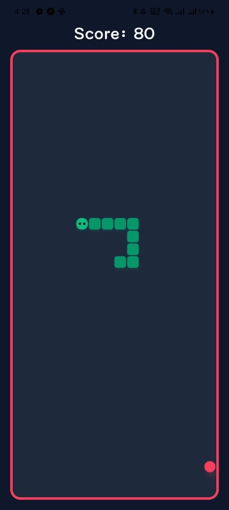
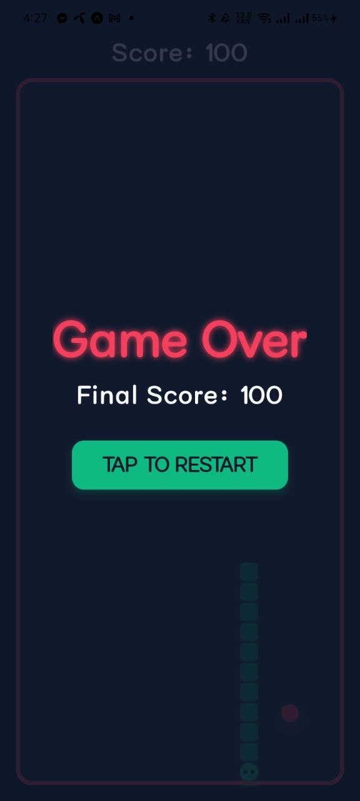

# 🐍 Neon Snake - React Native Expo

A modern, fast-paced, and visually stunning reimagining of the classic Snake game, built entirely with React Native and Expo. Experience smooth gesture-based controls, a premium dark neon UI, and fluid animations.

---

## ✨ Features

- **Modern UI/UX**: A beautiful dark slate theme paired with vibrant neon accents (green and pink/red).
- **Intuitive Controls**: Swipe anywhere on the screen seamlessly using `react-native-gesture-handler`.
- **Responsive Layout**: Automatically scales and perfectly fits any device grid using `react-native-safe-area-context`.
- **Subtle Animations**: Breathing animations on the food and styled snake segments with cute dynamic touches.
- **Score Tracking & Game Over States**: Complete game loop with collision detection and easy restart options.

---

## 📸 Screenshots

*(image1.jpg!)*

| Gameplay | Game Over Screen |
|:---:|:---:|
|  |  |

---

## 🛠️ Tech Stack

- **[React Native]** - Core framework for building the native iOS and Android experience.
- **[Expo]** - Toolchain for rapid development and testing.
- **[React Native Gesture Handler]** - For capturing native, high-performance swipe (pan) gestures without JavaScript thread lag.
- **[TypeScript]** - For strong typing and more robust code.

---

## 🚀 Getting Started

Follow these steps to run the game locally on your device or simulator:

### 1. Prerequisites
Make sure you have Node.js and an environment manager (npm, yarn, or bun) installed. You should also have the Expo Go app installed on your phone or an emulator configured on your PC/Mac.

### 2. Installation
Clone the repository and install the dependencies:

```bash
# Using bun (recommended for this project)
bun install

# Or using npm
npm install
```

### 3. Run the App
Start the Expo development server:

```bash
npx expo start
```
From here, simply scan the QR code with your phone's camera (iOS) or the Expo Go app (Android) to start playing!

---

## 🎮 How to Play

1. The game starts as soon as the grid loads.
2. **Swipe** `Up`, `Down`, `Left`, or `Right` to change the snake's direction.
3. Guide the snake to eat the bright, flashing red apples.
4. If you hit the neon red boundary wall, the game ends.
5. Tap the **RESTART** button on the final game over screen to try again.

---

## 📁 Project Structure

```text
snakeGameExpo/
├── App.tsx                    # Main Entry Point
├── package.json               # Dependencies & Scripts
└── src/
    ├── components/            # Reusable UI parts
    │   ├── Food.tsx           # Animated food component
    │   ├── Game.tsx           # Core game engine/loop
    │   └── Snake.tsx          # Styled snake segments
    ├── styles/                # Theming and UI definitions
    │   └── Colors.ts          # Centralized Neon color palette
    ├── types/                 # TypeScript interfaces
    │   └── types.ts           
    └── utils/                 # Extracted logic
        └── gameOver.ts        # Collision logic
```

---

## 🤝 Contributing

Contributions are completely welcome! If you want to add a feature (like high scores, sound effects, or obstacles), simply:
1. Fork the repository.
2. Create your feature branch (`git checkout -b feature/AmazingFeature`).
3. Commit your changes (`git commit -m 'Add some AmazingFeature'`).
4. Push to the branch (`git push origin feature/AmazingFeature`).
5. Open a Pull Request.

---

## 📜 License

This project is licensed under the MIT License - see the LICENSE file for details.
